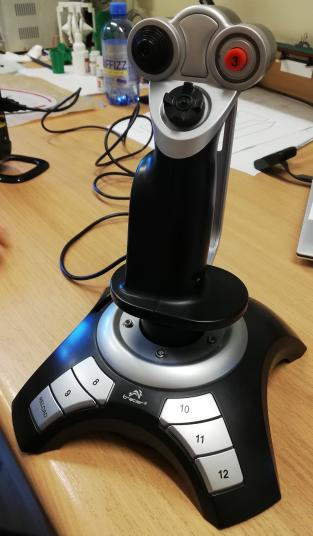
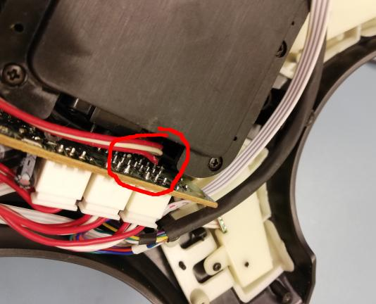
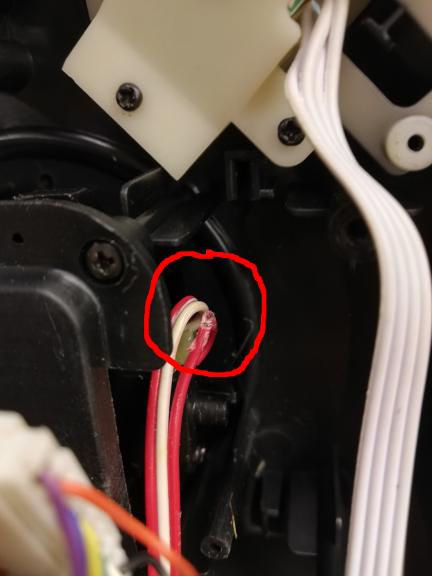
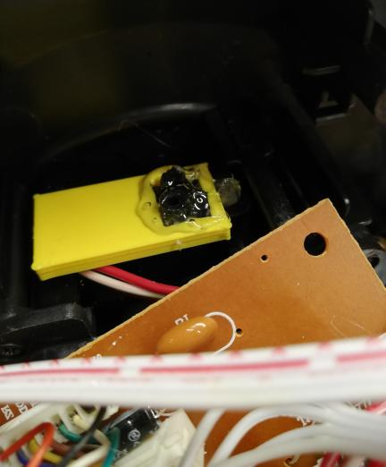

# joystick cable fix

"TRACER Joystick Black Hawk" has a design flaw.
internal cables connecting one of the axis are routed in such a away that they come to contact with THT components.

over time it causes insulation to rapture and causing short circuit.

fortunately the fix is fairly simple:
1) re-solder the ruptured cable.
2) insulate it with hot glue.
3) 3D print "shield", that makes sure cables do not touch the bottom of PCB.

this project solves the issue number 3. :)

