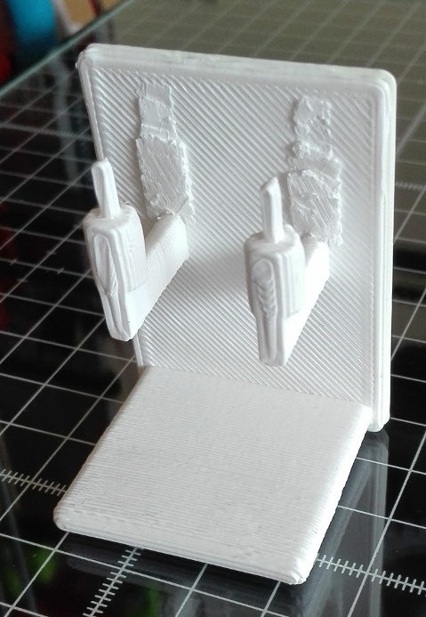

brush holder
===

holder for two endings to the philips' electric sonicare toothbrush. lower shelf makes sure
water does not drop down on the floor. after print and removing of bridges, construction
is meant to be glued/duck-taped to the wall in your favorite toothbrush spot.

print time: ~50 min
