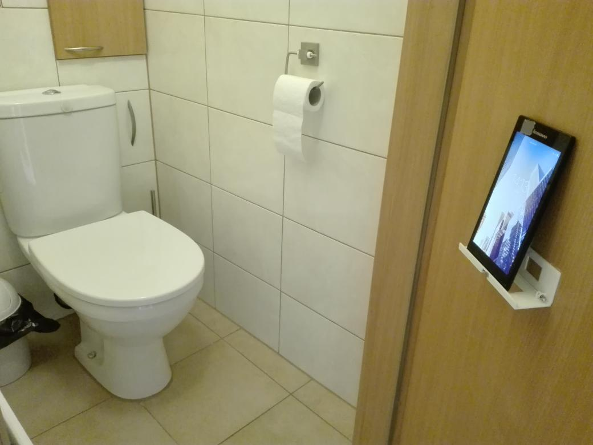

tablet door mount for toilet's door
===

support for tablet, to be mounted on doors/walls.
makes watching/reading stuff in the restroom way more convenient.

mechanism consists of two parts, connected with 2 joints.
thanks to this it can be compacted on the wall, to avoid accidentally catching on it, while moving around, near the door/wall.

in order to open/close it, neodymium magnets are used.
glue two magnets, one for each part, so that magnets connect in closed position.
to open shelf, it is enough to apply little force, to disconnect magnets.
there is a special edge on top of wall-mounted part, to glue magnet to.

to assemble it also requires:

 - 2x 3mm screw (at least 17mm in length)
 - 2x 3mm nut
 - 2x small magnet (neodymium preferably)

print time: ~50min
