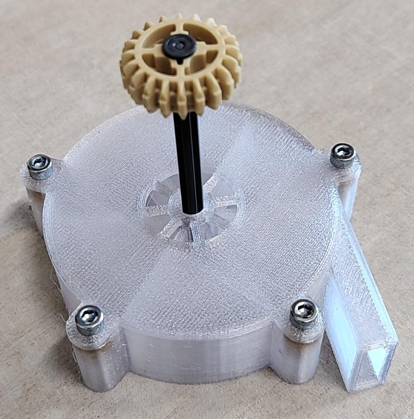

# toy centrifugal pump



children toy for pumping water using centrifugal force (aka: [centrifugal pump](https://en.wikipedia.org/wiki/Centrifugal_pump)).
rotor is compatible with LEGO axle.
model is easy to adjust using `common/config.scad` parameters (e.g. screws count).

PET-G is the suggested printing material, to make it both durable and see-through for children.

for [Voron 2.4](https://en.wikipedia.org/wiki/Voron_2.4) to get g-code files it's enough to run:
```
./make
```
note that upon 1st usage the script will build docker image with all the necessary tools, which may take a moment.
for non-Voron 2.4 printers the comamnd above will still generate STL files.

in order to assemble 5 threaded M3 threaded inserts are needed, as well as M3 screws.
anything between M3x10 and M3x20 will do.
