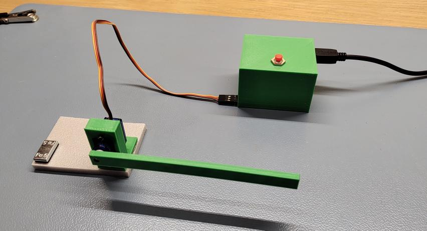
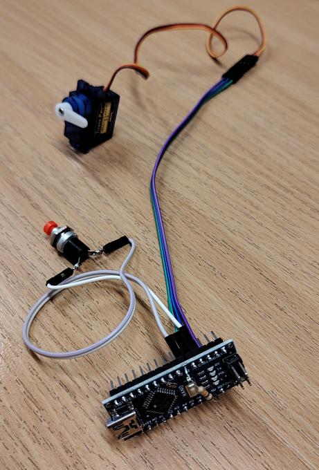
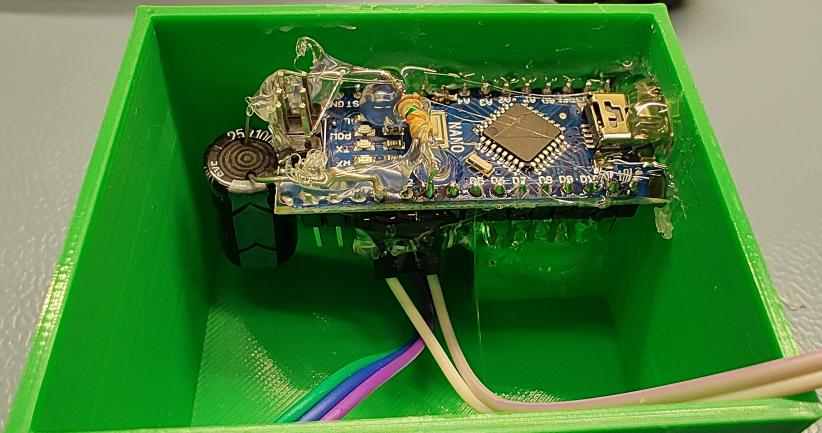

# toy railway barrier



toy railway barrier, having dual positions (up/.down).
rising and falling is done slowly, for better realism.

position is toggled by a button press.
default is up.

based on arduino nano board.

## wiring





servo shall be connected to pin 2.
+5V can be taken directly from the board.
depending on the board and power supply, you might want/need to solder 100µF decoupling capacitor on the power line.

monostable button shall be connected to pin 3.
it does not matter if button is normally open or closed - sw will handle both.
remember to add ~10k Ohm resistor from pin 3 to power line, so that button's state is stable.

## mechanical

most parts are to be glued with a hot glue gun.

servo get screwed into harness with dual M2x10 screws and nuts.
harness is designed for micro 9g servo.


## building

all builds are dockerized, thus no special SDK is needed locally.


### enclosure

```
cd enclosure
./make
```

by default it's tuned for my printer.
you can extend it with configs for your printer.
see [3d printing SDK](https://github.com/el-bart/3d_printing_sdk) for details.

alternatively you can just grab created `enclosure/build/*.stl`s and put them into your slicer of choice. :)


### software

connect arduino nano board to you computer and type:

```
cd sw
./make
```

this will build and flash your µC.
after that step it can be used with a regular phone charger, acting as a power supply. :)
